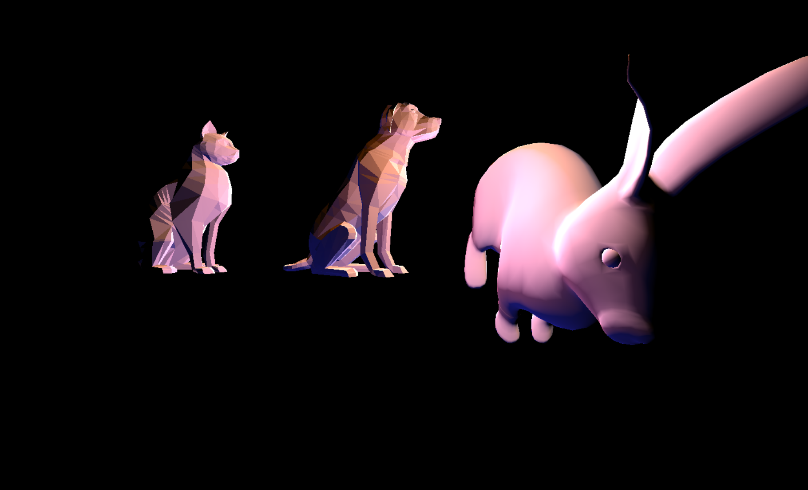
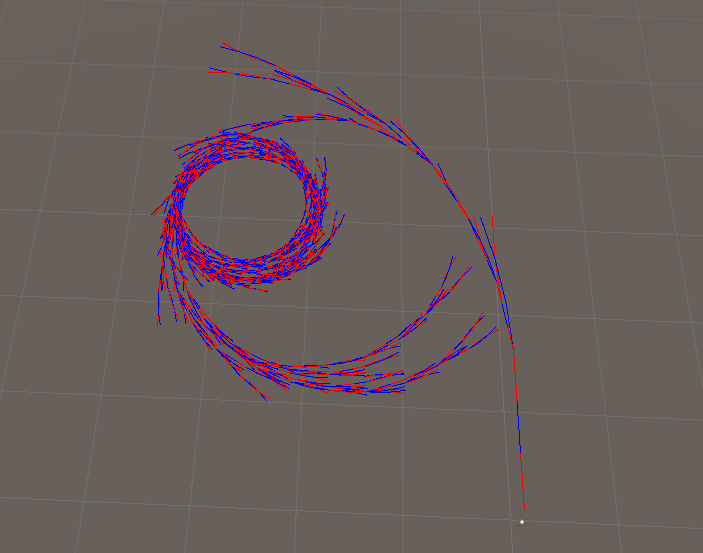

# CMPM163Labs
A public repo for CMPM163 class
Lab2:

Part1 :https://drive.google.com/open?id=1lgWhqeKB6sLize_V0O_QIYcWUl8qTaAb

Part2: 

---------------------------------------------------------------------------
Lab3:

video: https://drive.google.com/open?id=1M7jcxzOoDhuZ2sfECTCjvgTY8vWr_xJV

Cubes explaining:
1. The cube in the middle: this is cube from the part1 instruction. I did not change anything for that.
2. the spaning blue cube: this is the cube that I made for the part1, I changed its colors to blue, and change metalness to 0.9 and metalness ato 0.5.
3. the spaning red cube: this is also for the part1, I changed the colors to red and change transparency to 0.8.
4. the right cube: this is cube from the part2 instruction. I change it colors to 0xAF0FAF and 0x0000FF.
5. the left cube: this is the cube I made for the part2. My shader formula is gl_FragColor = vec4(mix(min(colorA,colorB)/st.x,max(colorB,colorC)/st.x, vUv.z), 1.0);. I passed four uniforms to the shader. They are colorsA, B, C and resolution. So it will take smaller color bewteen A and B, and bigger color bewteen B and C. Then make them devide by the st.x(gl_FragCoord.xy/u_resolution). Then mixed two colors together to get my cube.

---------------------------------------------------------------------------
Lab4: 

Video:   https://drive.google.com/open?id=1ny9-C2TpoFOmApPTDefOQVnJK0uxH4Vr

Answers for part1:
1. (a) Floor(7u).
2. (b)Floor(7-7v).
2. (c)Answer is Grey. From the Equation Above, Floor(7 * 0.375) = 2 and Floor(7 - 7 * 0.25) = 5, so (2,5), which is grey in the texture.

Cubes explaining:
1. The left cube is from the part A, which contain the texture, it is without the normal map.
2. the middel cube is from the partA, it contains the texture and normal map.
3. the top cube is from the partA, It has new texture and normal map.
4. the right cube is from the partB, it was built with the shader that instruction provided.
5. the button tiled cube is from the partB, it was built with my shader that samples the texture to four parts. the formula:   gl_FragColor = texture2D(texture2, 2.0*mod(vUv, 0.5));. In the shader, I first used the mod function to make texture four different parts, then I let the result of that multiple by 2, which scale the result and let it distributed properly.

---------------------------------------------------------------------------
Lab5: 

Video for part2a:   https://drive.google.com/open?id=1x8mGjAlx4qAVpWCt-y5adicWK1g9NeJ6

Video for part2b:   https://drive.google.com/open?id=1GlUoUxzUdMJYG9Ho0ny3miR1aRvm2nlj

Video for my particle effect: https://drive.google.com/open?id=1g7ycUtHM3ei67OAhWXduOYUHY5UwDKfJ

Particle Effect explaining: I got the inspiration from DNA. So I used sin and cos function to creat a DNA image. And the animation is to zoom in the DNA and break the DNA. In order to do that, I add few more velocity and change the animate function according to each particle position.

---------------------------------------------------------------------------
Lab6:

Screen Shot: 

Definitions of different lights:

2. 
spotlight: Spot light behave like a flashlight or headlamps on a car. They point in a direction based on their transform rotation and illuminate all objects within a cone.
directional light: The directional light behave like a sun. Directional lights effects all the objects in the scene, lighting them based on the direction of the light set by the game object rotation. position in the scene is irrelevant.
point light: The point light illuminates objects in the scene based on the light's position in the scene. Rotation has no influence on the light as this light shines equally in all directions.
Area light: Area lights shine in all directions to one side of rectangular plane.

3. My table picture: 
My material picture: 
I made this material by first taking a picture of the wood texture of my table. Then I change the shader for my material to specualar since this is a wood material there is no need to add metallic. Finally I ajust the smoothness to 0.1 to make it look more like my table.

4. I added two textures in the scene. One is the wall texture, another one is carpet texture. I used wall texutre to creat three walls in the scene, and I used carpet texture to creat floor in the scene.

5. I added a skybox which used a HDR map(downloaded from HDRIHaven.com) in the scene. It is a beach skybox. That means I missed the beach a lot during the quarantine.

------------------------------------------------------------------------------------------------------
Lab7:

1. 
2. 
3. video: https://drive.google.com/open?id=1sCkC5-S92tGONf_OJ-RAqKI15DRbr8nb
4. video: https://drive.google.com/open?id=1c_onqfD0zTPeZAiP-LlbDFpj_U8jHoVS

explain: for the creative, I made a blood lake which is in the mountain, And I added the particle effects like snow in the sky.

The answer from my partner:

Which part did they do? three.js
Which part of a tutorial did your partner find most challenging? creative
Which part of a tutorial did your partner find most interesting? creating the wave
We did not help each other in the lab.

---------------------------------------------------------------------------------------
Lab8:
1. 
2. Video :https://drive.google.com/open?id=1KfSR4IxVov8FZQp4fs8BMqo-dYHRQpsm
3. The inspiration is the coast city I found in the picture. The coast line is stright. so it is more easy to implement. And Also, I added the blue sky in the air. The building is different in the picture. So I added four different textures in the scene.

My partner: My precedural city is based on Venice. I changed the position of the buildings that aloows all the building to be built on grass, and the plane was changerd to water like texture. AS a result, it looks like a city over rivers.

---------------------------------------------------------------------------------------
Lab9:
1. 

2. 
3. My own L-system is based on the fractal plant system. I modify its rule to F-> FFF-[-F+F+F]-[+F-F-F]. This is making an animal eye looking image. It seemed pretty cool to me. I also changed the angle to 5 degree in order to make it draw the circle more clearly. The color of line is depending on the index of the the F in the array.

